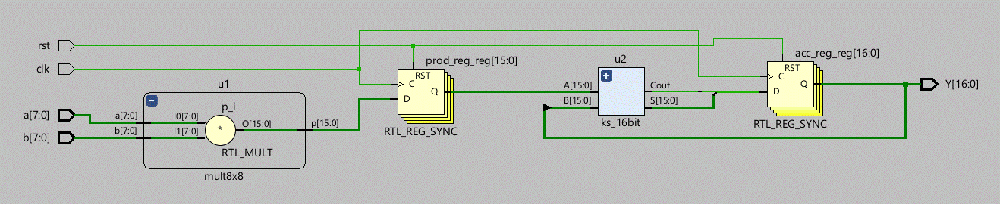

# 8-bit Pipelined MAC Unit with 16-bit Kogge-Stone Adder 
(v1.0) - _04/Feb/2026_

Implementation and Simualtion of an 8 bit high-performance Multiply Accumulate (MAC) unit using a 2-stage pipeline. The design uses a 16-bit Kogge–Stone prefix adder for fast accumulation.

## RTL Architecture

1. 8-bit MAC unit
2. 8x8 Multiplier
3. 16-bit Kogge Stone Adder

## Schematic 
### Collapsed View (Top-Level Hierarchy)

# Progress
Version 1 uses a line-by-line derived KS structure to ensure correctness and ease of verification. Functional simulation in Vivado confirms correct accumulation, reset behavior, and overflow characteristics.
